# Multi-Agent Workflow Diagram

## Simple 6-Agent Architecture

```mermaid
graph TD
    %% User and System Interaction
    USER["`👤 **User**<br/>Sends Message`"]
    
    %% Main Orchestrator
    ORCHESTRATOR["`🎯 **Orchestrator Agent**<br/>Analyzes Request<br/>Routes to Specialist<br/>gemini-2.5-flash`"]
    
    %% Specialized Agents
    IDEATE["`💡 **Ideate Agent**<br/>Generates Creative Ideas<br/>3-5 Concepts<br/>gemini-2.5-flash`"]
    
    OUTLINE["`📋 **Outline Agent**<br/>Creates Content Structure<br/>Hierarchical Layout<br/>gemini-2.5-flash`"]
    
    DRAFT["`✍️ **Draft Agent**<br/>Writes Full Content<br/>Complete Articles<br/>gemini-2.5-flash`"]
    
    FEEDBACK["`👨‍💼 **Persona Feedback Agent**<br/>Expert Review & Chat<br/>Professional Guidance<br/>gemini-2.5-flash`"]
    
    SEO["`🔍 **SEO Agent**<br/>Search Optimization<br/>Keywords & Rankings<br/>gemini-2.5-flash`"]
    
    %% User Message Flow
    USER -->|"📨 User Message"| ORCHESTRATOR
    
    %% Orchestrator Decision Routes
    ORCHESTRATOR -->|"💡 Ideas Request"| IDEATE
    ORCHESTRATOR -->|"📋 Structure Request"| OUTLINE
    ORCHESTRATOR -->|"✍️ Writing Request"| DRAFT
    ORCHESTRATOR -->|"💬 Review/Chat Request"| FEEDBACK
    ORCHESTRATOR -->|"🔍 SEO Request"| SEO
    
    %% Agent Responses Back to User
    IDEATE -->|"💡 Creative Ideas Response"| USER
    OUTLINE -->|"📋 Structured Outline Response"| USER
    DRAFT -->|"✍️ Complete Content Response"| USER
    FEEDBACK -->|"👨‍💼 Expert Feedback Response"| USER
    SEO -->|"🔍 Optimized Content Response"| USER
    
    %% Styling
    classDef userStyle fill:#e3f2fd,stroke:#1976d2,stroke-width:3px,color:#000
    classDef orchestratorStyle fill:#fff3e0,stroke:#f57c00,stroke-width:3px,color:#000
    classDef agentStyle fill:#e8f5e8,stroke:#388e3c,stroke-width:2px,color:#000
    
    class USER userStyle
    class ORCHESTRATOR orchestratorStyle
    class IDEATE,OUTLINE,DRAFT,FEEDBACK,SEO agentStyle
```

## Workflow Description

### **Flow Process:**
1. **User** sends a message/request
2. **Orchestrator Agent** analyzes the request and decides which specialist to route to
3. **Selected Agent** processes the request and generates a response
4. **Response** goes directly back to the user

### **Agent Responsibilities:**

- **🎯 Orchestrator Agent**: Master coordinator that analyzes user requests and routes to appropriate specialists
- **💡 Ideate Agent**: Generates 3-5 creative ideas and concepts 
- **📋 Outline Agent**: Creates structured content outlines and hierarchical layouts
- **✍️ Draft Agent**: Writes complete content drafts and full articles
- **👨‍💼 Persona Feedback Agent**: Provides expert review, feedback, and interactive chat
- **🔍 SEO Agent**: Optimizes content for search engines with keywords and technical improvements

### **Key Features:**
- Simple, direct routing (no complex workflows)
- One agent handles each request type
- All agents use gemini-2.5-flash model
- Fast, focused responses
- Clear specialization boundaries
